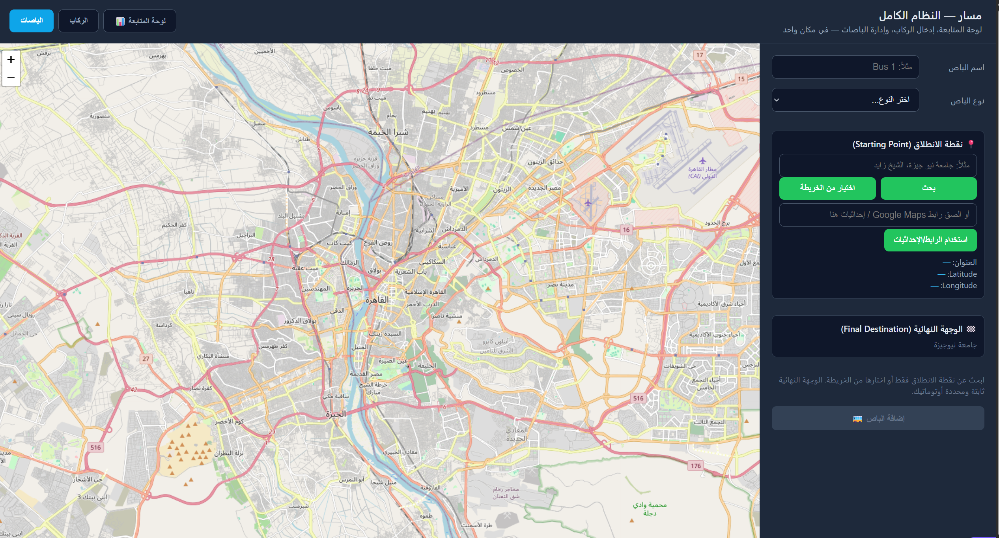
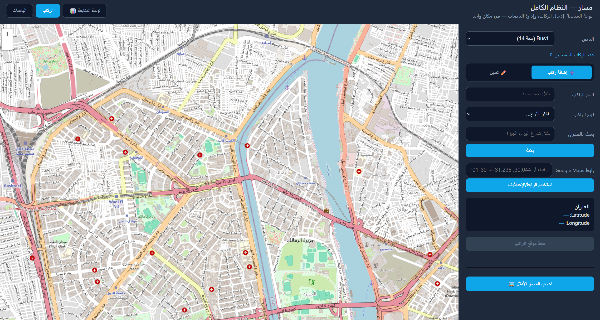
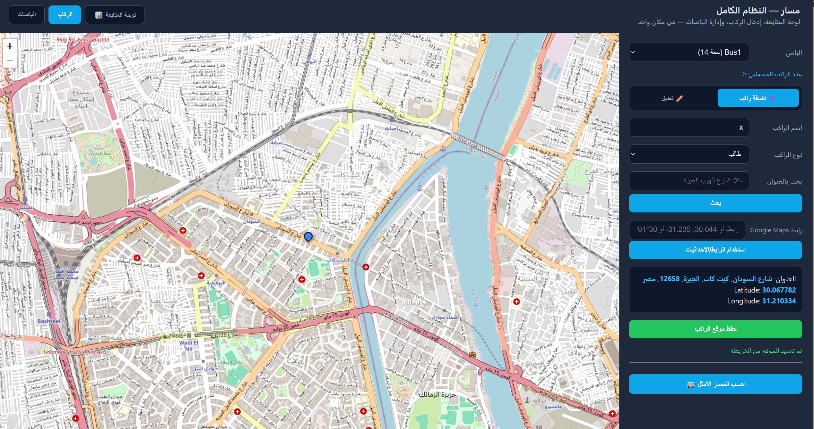
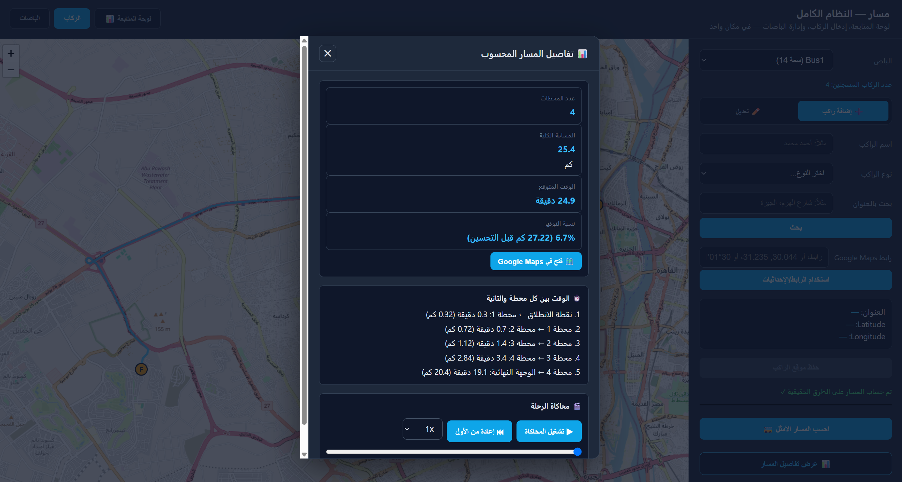
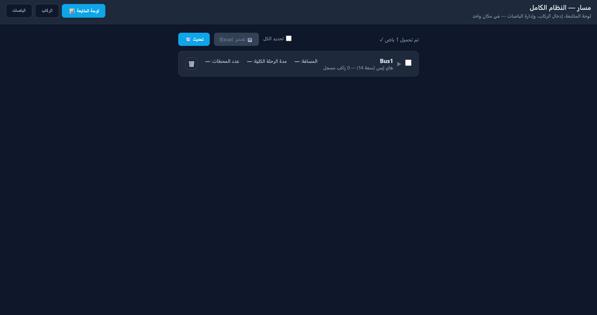
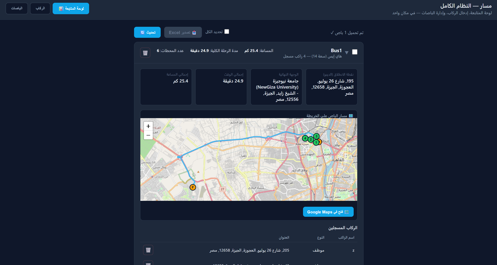
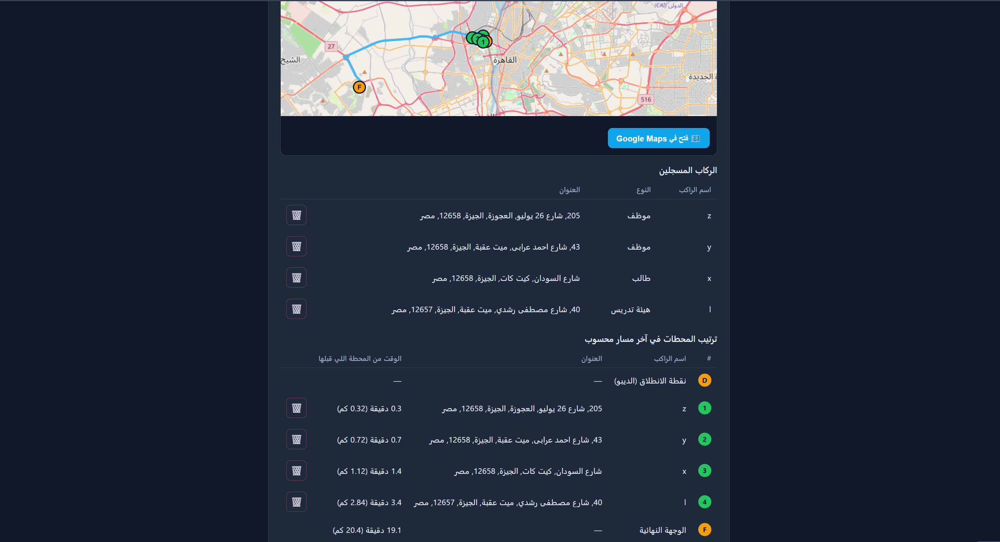

# Masar 🚌

**Bus route optimization for university and company transportation.**

> ### ⚡ Stop guessing the pickup order.

> Got passengers scattered across the city and no idea what order to pick them up in? **Masar solves it.** It calculates the **fastest route for every bus** using **real roads** and **live traffic**, then shows it on an interactive map dashboard.

---

## Features

- 🚌 Manage buses (Hiace / Coaster), each with its own capacity, depot and destination
- 👥 Add passengers (employee / student / faculty) with name and address
- 🧠 Route optimization with **Google OR-Tools** (start at depot → pick up everyone → end at destination)
- 🚦 **Live-traffic** travel times via **TomTom** (optional)
- 🗺️ Real road distances and geometry via **OSRM** (free, used automatically when TomTom is not configured)
- 🛟 Automatic fallback to straight-line (haversine) estimates if no Masar service is reachable
- 📊 Dashboard with a card per bus: route map, stop order, time and distance for every leg
- ✏️ Edit mode: drag depot, destination and passengers on the map, then save all changes at once
- 🎬 Trip simulation: watch the bus drive along the computed route
- 🗺️ Open any route in Google Maps
- 📥 Export selected buses to Excel (summary sheet + one sheet per bus)
- 🔗 Add locations by address search, map click, or a pasted Google Maps link / coordinates
- 💾 Routes and per-stop details are saved in PostgreSQL

---

## Tech stack

| Layer | Technology |
|---|---|
| API | FastAPI + Uvicorn |
| Optimization | Google OR-Tools |
| Masar / traffic | OSRM, TomTom (Matrix + Masar APIs) |
| Database | PostgreSQL (psycopg2) |
| Frontend | Single-page dashboard (`Masar-app.html`) with Leaflet, OpenStreetMap tiles, Nominatim and SheetJS |

---

## Screenshots
 
### 1. Add a Bus
Register a bus by choosing its name, type, starting point, and final destination.
 

 
### 2. Passengers Tab
Select a bus, then add passengers or switch to edit mode.
 

 
### 3. Adding a Passenger
Enter the passenger's name and type, then pick the location from the map. The pin shows before saving.
 

 
### 4. Route Summary and Simulation
After computing the route you get the total distance, expected time, savings versus the unoptimized order, time between stops, and a trip simulation.
 


### Simulation Video


 
### 5. Dashboard Overview
All buses in one place, with distance, trip time, and number of stops. Select buses to export them to Excel.
 

 
### 6. Bus Details on the Dashboard
Expand a bus card to see the start and end points, total time and distance, and the route drawn on the map.
 

 
### 7. Registered Passengers and Stop Order
The passenger list and the final optimized stop order, with the time and distance from the previous stop.
 



---

## Getting started

### 1. Prerequisites

- Python 3.10+
- PostgreSQL
- [TomTom API key](https://developer.tomtom.com/) for live traffic

### 2. Install

```bash

pip install -r requirements.txt
```

### 3. Set up the database

```bash
psql -U postgres -c "CREATE DATABASE masar_db;"
psql -U postgres -d masar_db -f schema.sql
```

### 4. Configure

Copy the templates and fill in your own values:

```bash
copy db_config.example.json db_config.json     # Windows
copy .env.example .env
# macOS / Linux: cp db_config.example.json db_config.json && cp .env.example .env
```

- **`db_config.json`**: your PostgreSQL host, port, database name, user and password
- **`.env`**: `TOMTOM_API_KEY=...` 


### 5. Run

```bash
python main.py
```

The server starts on `http://127.0.0.1:8000` and opens the dashboard in your browser automatically.
Interactive API docs are available at `http://127.0.0.1:8000/docs`.

---


